<div align="center">

# 🏜️ النجاة في الصحراء

### Desert Survival 3D

**لعبة مغامرات ثلاثية الأبعاد في المتصفح — اجتز الصحراء القاسية وصل للمخيم قبل نفاذ الوقود.**

[](https://abosalehg-ui.github.io/survival-skills3D/)
[](https://threejs.org/)
[](https://developer.mozilla.org/en-US/docs/Web/HTML)
[](https://developer.mozilla.org/en-US/docs/Web/JavaScript)

[](https://github.com/abosalehg-ui/survival-skills3D/actions/workflows/ci.yml)
[](LICENSE)


### [🎮 العب الآن مباشرة من المتصفح](https://abosalehg-ui.github.io/survival-skills3D/)

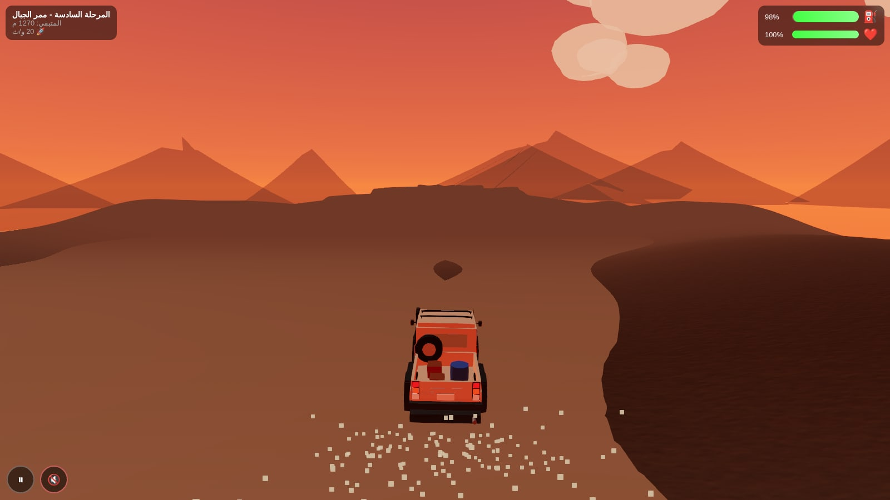

<sub>المرحلة السادسة — ممر الجبال عند الغروب</sub>

</div>

---

## 🎯 فكرة اللعبة

أنت عالق في صحراء شاسعة مع سيارتك ووقود محدود. هدفك الوصول إلى **هدف كل مرحلة** — محطة بنزين أو واحة أو مخيم — قبل أن ينفد الخزان.

الوقود هو القيد الحقيقي: العبور النظيف يستهلك أغلب الخزان، فكل علبة وقود تفوّتها قرار، وكل صخرة تصطدم بها تكلّفك صحة **ووقوداً**. الدوس على الخانق يجعلك أسرع لكنه أعطش لكل متر — أفضل مدى تحصل عليه عند السرعة العادية.

## ✨ المميزات

| الميزة | الوصف |
|--------|-------|
| 🎮 **رسومات 3D** | بيئة ثلاثية الأبعاد غامرة باستخدام Three.js |
| 🎯 **4 أوضاع لعب** | القصة (6 مراحل)، سباق الوقت، اللانهائي، والتحدي اليومي |
| 🚗 **4 مركبات** | شاص، جيب قديم، بيك-أب، وشاحنة صغيرة — **الدرع يقايض المدى**: لا مركبة أفضل من أخرى في كل شيء |
| 📱 **تحكم سهل** | سحب/أزرار على الجوال، أسهم أو WASD على الحاسوب |
| ⛽ **الوقود قيد حقيقي** | العبور النظيف يستهلك أغلب الخزان — كل علبة وقود قرار |
| 🚀 **خانق بمقايضة** | الدوس أسرع لكنه أعطش لكل متر؛ أفضل مدى عند السرعة العادية |
| 🚩 **نقاط تفتيش** | في المراحل الطويلة، تستطيع المتابعة من المنتصف بدل إعادة كل شيء |
| ♿ **وصولية** | تقليل الحركة، كتم بضغطة، نسب رقمية على الأشرطة (لا تعتمد على اللون وحده) |
| 🌪 **عواصف رملية** | طقس ديناميكي يقيّد الرؤية والتوجيه |
| 🏅 **إنجازات وأرقام قياسية** | 10 إنجازات وأفضل الأزمنة/المسافات تُحفظ محلياً |
| 📲 **PWA دون اتصال** | ثبّتها كتطبيق والعب بلا إنترنت |
| 🌐 **واجهة عربية** | تجربة لعب كاملة باللغة العربية |

## 🎨 لقطات من اللعبة

### 🗺️ المراحل والبيئات

<div align="center">

| ☀️ المرحلة الأولى — الصباح | 🌙 المرحلة الثالثة — الليل |
|:---:|:---:|
| 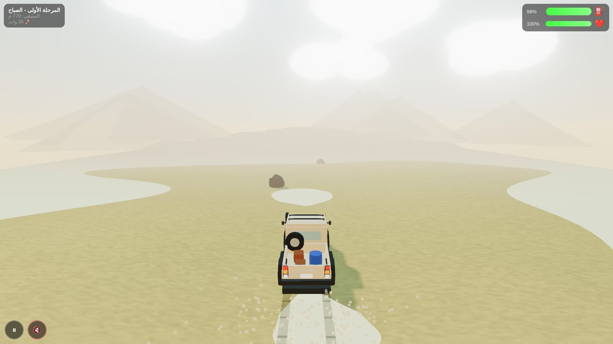 | 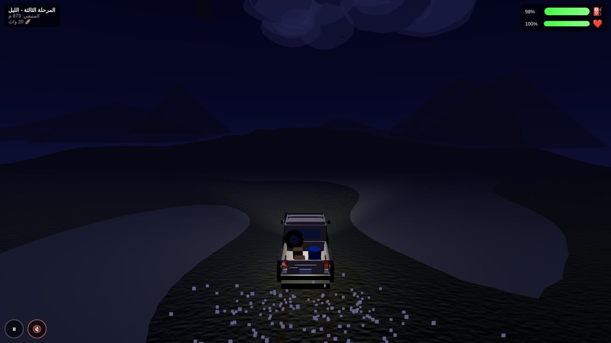 |
| كثبان هادئة وضباب خفيف — أول درس في إدارة الوقود | إضاءة كاملة بالمصابيح الأمامية ومدى رؤية أقصر |
| **🪨 المرحلة الرابعة — الصحراء الصخرية** | **🌴 المرحلة الخامسة — الواحة** |
| 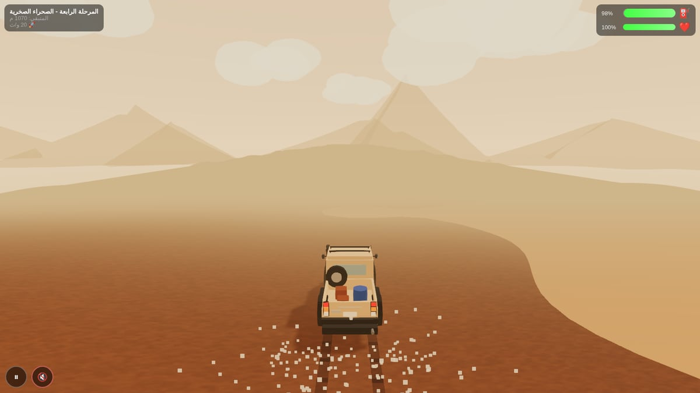 | 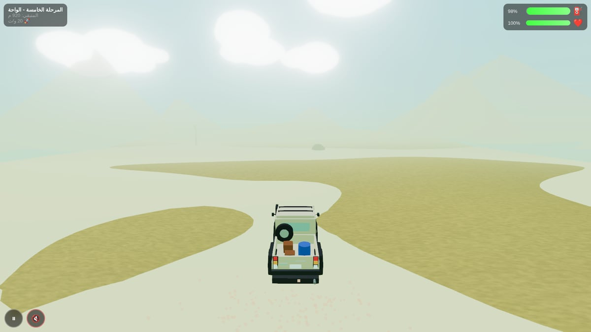 |
| عواصف رملية تقيّد الرؤية والتوجيه | نخيل وخضرة وطريق أوسع… بعد ثلاث مراحل قاسية |

</div>

### 🖥️ الواجهات

<div align="center">

| القائمة الرئيسية | اختيار الوضع |
|:---:|:---:|
| 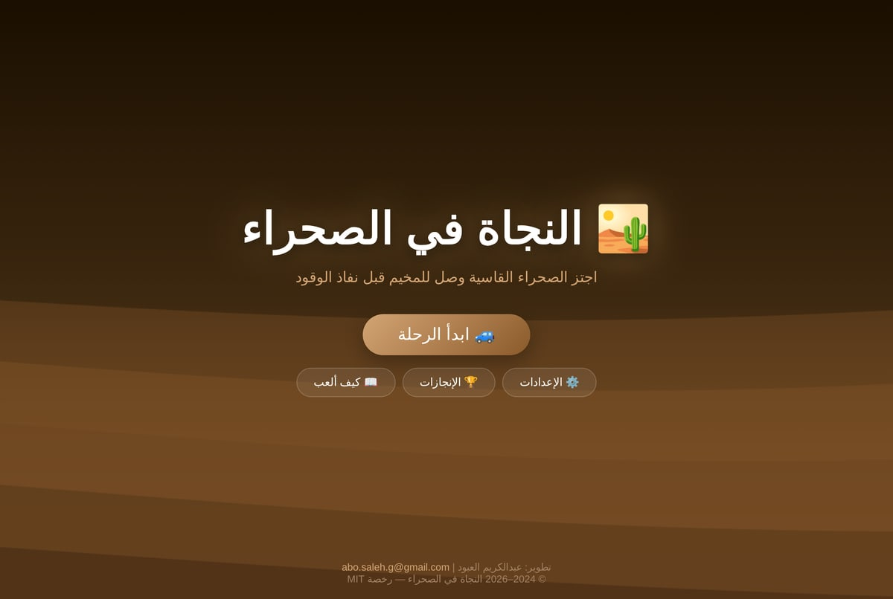 | 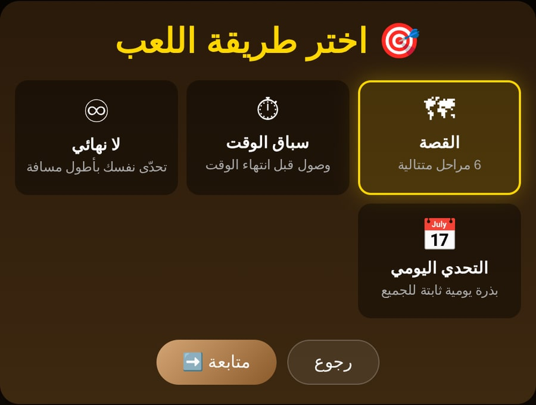 |
| **اختيار المركبة** | **اختيار المرحلة** |
| 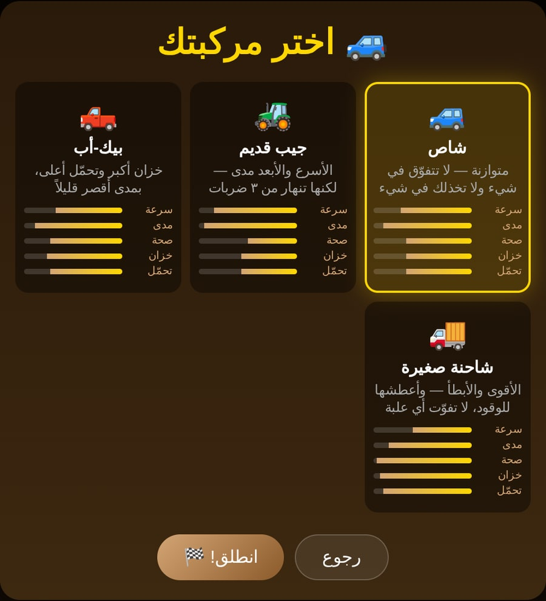 | 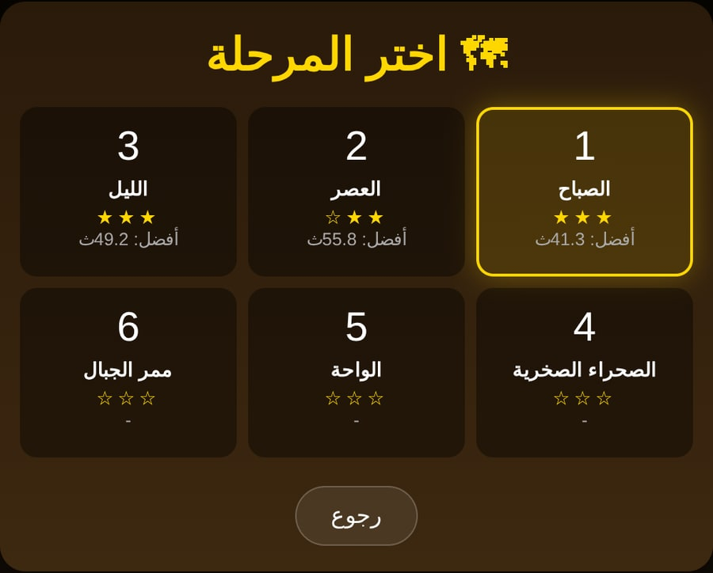 |
| **الإنجازات** | **الإعدادات والوصولية** |
| 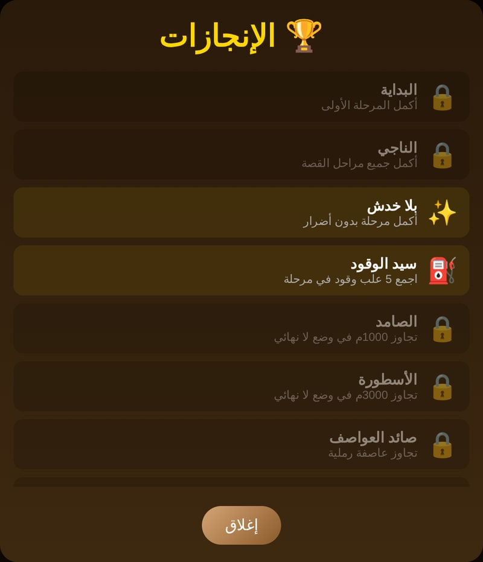 | 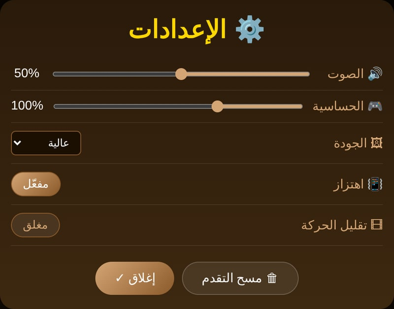 |

</div>

### 🏁 نهاية المرحلة

<div align="center">

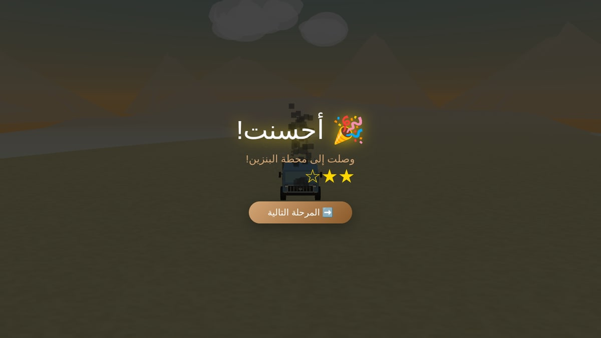

<sub>وصول ناجح إلى محطة البنزين — النجوم تُمنح على الإكمال، والعبور بلا أضرار، والسرعة</sub>

</div>

### 📱 على الجوال

<div align="center">

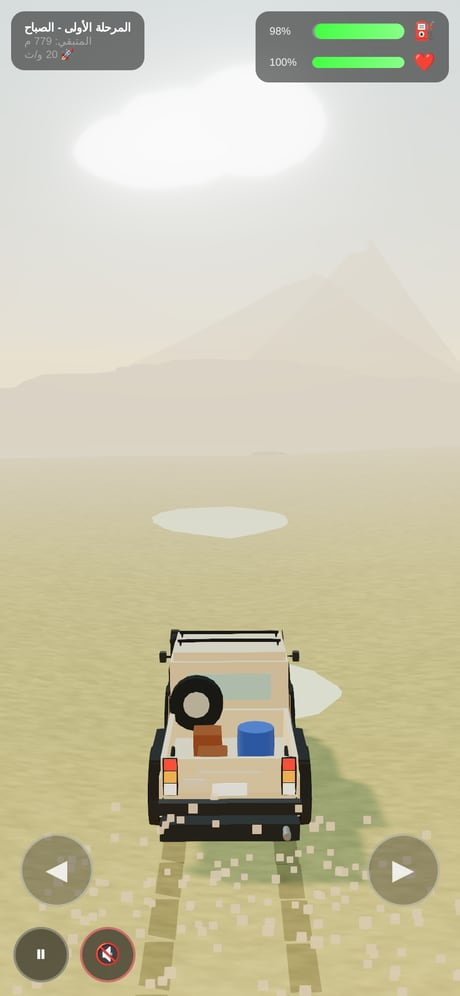

<sub>أزرار توجيه كبيرة + سحب بالإصبع، وواجهة تتكيّف مع الشاشة الرأسية</sub>

</div>

## 🎮 أوضاع اللعب

| الوضع | الوصف |
|---|---|
| 🗺 **القصة** | ست مراحل متتالية تُفتح تباعاً، مع تقييم نجوم لكل مرحلة |
| ⏱ **سباق الوقت** | كل المراحل مفتوحة — صل قبل انتهاء المؤقّت |
| ♾ **لا نهائي** | صحراء بلا نهاية؛ التحدي هو أطول مسافة تصمد فيها |
| 📅 **التحدي اليومي** | بذرة عشوائية واحدة ثابتة لكل اللاعبين في اليوم نفسه |

## 🚙 المركبات

لا توجد مركبة «أفضل» — كل واحدة مقايضة بين الدرع والمدى:

| المركبة | الطابع |
|---|---|
| 🚙 **شاص** | متوازنة — لا تتفوّق في شيء ولا تخذلك في شيء |
| 🚜 **جيب قديم** | الأسرع والأبعد مدى — لكنها تنهار من ثلاث ضربات |
| 🛻 **بيك-أب** | خزان أكبر وتحمّل أعلى، بمدى أقصر قليلاً |
| 🚚 **شاحنة صغيرة** | الأقوى والأبطأ — وأعطشها للوقود، لا تفوّت أي علبة |

## 🕹️ طريقة اللعب

### التحكم

| الجهاز | التوجيه | التسريع/الفرملة | الإيقاف |
|---|---|---|---|
| 📱 **الجوال** | اسحب بإصبعك يميناً/يساراً أو استخدم الزرين ◀ ▶ | — | زر ⏸ |
| 💻 **الحاسوب** | ← → أو A / D | ↑ ↓ أو W / S | Esc أو P |

### العناصر في الطريق

| العنصر | الأثر |
|---|---|
| ⛽ **علبة وقود خضراء** | +10 وقود، +5 صحة |
| ⛽ **علبة زرقاء (مضاعف)** | العلبة التالية تعطي +20 وقوداً |
| ⚡ **تعزيز سرعة (أصفر)** | سرعة ×1.5 لمدة 5 ثوانٍ |
| 🛡️ **درع (سماوي)** | يحميك من الاصطدام التالي |
| 🪨 **صخور وحُفر** | تنقص الصحة والوقود |
| 🌪 **عاصفة رملية** | رؤية محدودة وتوجيه أصعب |

### نصائح للفوز

1. ⛽ لا تفوّت أي علبة وقود — الخزان بالكاد يكفي للوصول
2. 🚀 استخدم الخانق للتفادي لا للسفر؛ السرعة العادية تعطيك أفضل مدى
3. 🎯 المسار المستقيم أرخص من التعرّج
4. 🚩 في المراحل الطويلة، نقطة التفتيش تنقذ محاولتك

## 🚀 التشغيل

### الطريقة الأولى: اللعب مباشرة

<https://abosalehg-ui.github.io/survival-skills3D/>

### الطريقة الثانية: التشغيل المحلي

```bash
# استنساخ المستودع
git clone https://github.com/abosalehg-ui/survival-skills3D.git
cd survival-skills3D

# شغّل خادماً محلياً (مطلوب لوحدات ES ولعمل الـ PWA)
python3 -m http.server 8000

# ثم افتح في المتصفح
# http://localhost:8000
```

> ⚠️ فتح `index.html` مباشرة من القرص (بروتوكول `file://`) لا يكفي: وحدات ES وعامل الخدمة
> (Service Worker) تحتاج خادماً حقيقياً — أي خادم ثابت يفي بالغرض.

### الاختبارات

```bash
node tests/logic.test.mjs   # اختبارات الدوال المنطقية (بلا متصفح)
```

يتحقق سير عمل CI من صحة بناء الجملة في `index.html` و`service-worker.js` ويشغّل هذه الاختبارات في كل دفعة.

## 🛠️ التقنيات المستخدمة

| التقنية | الاستخدام |
|---------|-----------|
| **Three.js** | محرك الرسومات ثلاثية الأبعاد |
| **HTML5 / CSS3** | هيكلة الصفحة والتصميم والحركات |
| **JavaScript (ES Modules)** | منطق اللعبة والتفاعل — بلا أدوات بناء |
| **Canvas 2D + WebAudio** | توليد كل الخامات والأصوات وقت التشغيل |
| **Service Worker + Manifest** | العمل دون اتصال والتثبيت كتطبيق |
| **GitHub Actions + Pages** | الفحص الآلي والاستضافة |

## 📁 هيكل المشروع

```
survival-skills3D/
├── index.html              # اللعبة كاملة في ملف واحد (كل الرسوميات إجرائية تقريباً — استثناء وحيد أدناه)
├── service-worker.js       # التخزين المؤقت للعمل دون اتصال (PWA)
├── manifest.webmanifest    # بيانات تثبيت التطبيق (PWA)
├── assets/models/          # استثناء وحيد: نموذج الجمل (camel.glb) — اختياري، محلي
├── icons/                  # أيقونات التطبيق
├── tests/                  # اختبارات منطقية تعمل بـ node بلا متصفح
├── docs/                   # خطط التطوير والمراجعات الهندسية + لقطات الشاشة
└── README.md               # ملف التوثيق
```

> 🧱 **قاعدة معمارية**: كل الرسوميات والمؤثرات تُولَّد برمجياً وقت التشغيل (Canvas/WebAudio)
> بلا نماذج GLB أو صور خامات أو ملفات صوت — **باستثناء وحيد معتمد**: نموذج الجمل
> (`assets/models/camel.glb`، محلي من نفس الأصل لا CDN خارجي). يُحمَّل بشكل غير معطِّل
> ويبقى الجمل الإجرائي احتياطياً دائماً إن غاب الملف، فتعمل اللعبة دون اتصال بالكامل في
> كل الأحوال (بجمل إجرائي بدل النموذج فقط إن لم يُخزَّن الملف مسبقاً).

## ♿ الوصولية والإعدادات

| الخيار | أين |
|---|---|
| 🔇 كتم فوري | زر بجانب زر الإيقاف أثناء اللعب |
| 🎞 تقليل الحركة | الإعدادات — يوقف اهتزاز الكاميرا وتوقف الإطار والوميض. يُفعَّل تلقائياً أيضاً إن كان `prefers-reduced-motion` مفعّلاً في نظامك |
| 🔢 نسب رقمية | تظهر بجانب شريطَي الوقود والصحة، فلا تُنقل الخطورة باللون وحده |
| 🔊 مستوى الصوت / 🎮 الحساسية / 🖼 الجودة | الإعدادات |
| 📳 اهتزاز | الإعدادات |

## 🔒 الأمان والخصوصية

- **لا تُجمع أي بيانات**: لا تحليلات ولا تتبّع ولا كوكيز. كل التقدّم في `localStorage` على جهازك.
- **سلسلة التوريد**: كل وحدات Three.js (النواة والإضافات) مثبّتة بهاش **SRI** في `importmap`، مع **CSP** يقصر مصادر السكربتات على هذا الأصل و`cdn.jsdelivr.net` فقط.
- **متانة الحفظ**: ملف حفظ تالف أو مبتور يُصلَح تلقائياً بالقيم الافتراضية بدل أن يمنع اللعبة من العمل.

## ✅ ما تم إنجازه

- [x] 🎵 مؤثرات صوتية وموسيقى إجرائية (WebAudio، دون ملفات صوت خارجية)
- [x] 🌪️ عواصف رملية ديناميكية (تقيّد الرؤية والتوجيه)
- [x] 🏅 إنجازات وأرقام قياسية محفوظة محلياً + تقييم نجوم للمراحل
- [x] 🚗 أربع مركبات للاختيار، لكلٍّ إحصاءاتها
- [x] 🗺️ ست مراحل قصة + سباق وقت + لا نهائي + تحدٍّ يومي
- [x] 🌙 مرحلة ليلية كاملة بإضاءة ومصابيح أمامية
- [x] ⚖️ إعادة ضبط الاقتصاد: الوقود صار القيد الفعلي، والخانق مقايضة حقيقية، ولا مركبة مهيمنة
- [x] 🎯 حركة مستقلة تماماً عن معدل الإطارات (نفس السلوك على 30 و60 و144 هرتز)
- [x] 🚀 دمج هندسة المركبات (مئات الأجسام → عدد قليل من draw calls)
- [x] ♿ تقليل الحركة، كتم فوري، ونسب رقمية على الأشرطة
- [x] 🪨 إصلاح الصخور المتشظّية (كانت تُرسم كقطع منفصلة بينها فراغات)
- [x] 🚙 السيارة تلامس الأرض فعلياً بإطاراتها بدل أن تطفو فوقها

## 🔮 التطويرات المستقبلية

- [ ] 🎮 تخصيص أزرار لوحة المفاتيح (WASD والأسهم مدعومتان حالياً)
- [ ] 🌐 لوحة صدارة للتحدي اليومي (تتطلب خادماً — تُشارَك النتيجة حالياً عبر زر «شارك نتيجتك»)
- [ ] 🏞️ مراحل وبيئات إضافية

## 🤝 المساهمة

المساهمات مرحب بها! إذا كانت لديك أفكار لتحسين اللعبة:

1. اعمل Fork للمستودع
2. أنشئ فرعاً جديداً (`git checkout -b feature/ميزة-جديدة`)
3. نفّذ التغييرات (`git commit -m 'إضافة ميزة رائعة'`)
4. تأكد أن `node tests/logic.test.mjs` يمر
5. افتح Pull Request

## 📄 الترخيص

الكود مرخّص بموجب **رخصة MIT** — انظر ملف [`LICENSE`](LICENSE).
الاستثناء الوحيد هو نموذج الجمل (`assets/models/camel.glb`) المرخّص بـ CC-BY 4.0
(انظر قسم «شكر وتقدير» أدناه وملف `assets/models/README.md`).

## 🙏 شكر وتقدير

نموذج الجمل (`assets/models/camel.glb`) — الاستثناء الوحيد لقاعدة «لا أصول
خارجية» — مبنيّ على عمل:

> "[Camel (Download the original glb)](https://skfb.ly/oRFt6)" by
> [kenchoo](https://sketchfab.com/kenchoo) is licensed under
> [Creative Commons Attribution 4.0](http://creativecommons.org/licenses/by/4.0/).

النموذج المُستخدَم في اللعبة **مُعدَّل** عن الأصل: بُسِّطت الهندسة (79,165 → 7,972
مثلث)، وحُذف الهيكل العظمي والأنيميشن (غير مُستخدَمين في نظام العقبات الحالي)،
وصُغِّرت الخامات (1024×1024 → 512×512) — تفاصيل المعالجة في
`assets/models/README.md`.

## 👨‍💻 المطور

<div align="center">

**عبدالكريم العبود**

[](mailto:abo.saleh.g@gmail.com)
[](https://github.com/abosalehg-ui)

</div>

---

<div align="center">

### 🏜️ هل أنت مستعد للتحدي؟

[🎮 ابدأ اللعب الآن!](https://abosalehg-ui.github.io/survival-skills3D/)

صُنع بـ ❤️ و ☕

</div>
